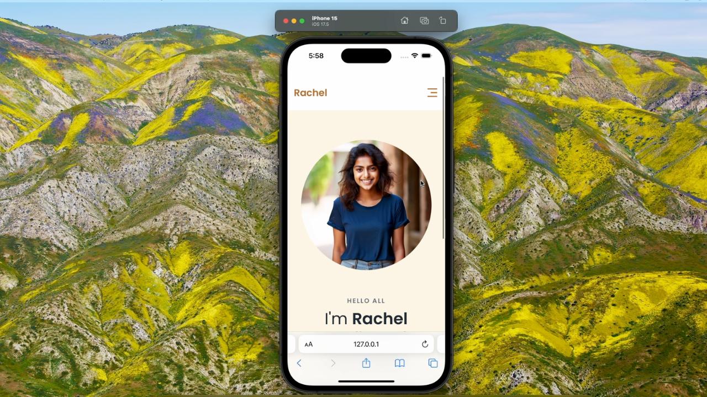

# Portfolio Website

Welcome to the Portfolio Website for a Full Stack Developer repository! This project showcases a professional portfolio website built to highlight the skills, projects, and experience of a full stack developer, using HTML, CSS, and JavaScript.

## Features

- **Responsive Design**: Optimized for all screen sizes, including mobile, tablet, and desktop.
- **Modern Layout**: Clean and visually appealing design with a focus on user experience.
- **Interactive Elements**: Includes hover effects, animations, and responsive buttons to enhance user engagement.
- **Easy Customization**: Well-organized and commented code to facilitate customization and updates.

## Demo

Check out the live demo [here](https://salow-studios.github.io/Project-4-Portfolio-Website/).

Click to view Source Code on [Youtube](https://www.youtube.com/watch?v=NPoNJ931gto)

## Screenshots




## Getting Started

### Prerequisites

To run this project, you need a web browser and a code editor (e.g., VS Code).

### Installation

1. Clone the repository:
    ```bash
    git clone git@github.com:Salow-Studios/Project-4-Portfolio-Website.git
    ```

2. Navigate to the project directory:
    ```bash
    cd Project-4-Portfolio-Website
    ```

3. Open `index.html` in your web browser to view the landing page.

## Usage

- Customize the HTML content in `index.html` to match your travel website details.
- Modify the CSS styles in `styles.css` to fit your branding and design preferences.

## Contributing

Contributions are welcome! Please follow these steps to contribute:

1. Fork the repository.
2. Create a new branch (`git checkout -b feature-branch`).
3. Make your changes and commit them (`git commit -m 'Add some feature'`).
4. Push to the branch (`git push origin feature-branch`).
5. Open a pull request.

## License

This project is licensed under the MIT License. See the `LICENSE` file for details.

## Acknowledgments

- Inspired by modern website designs.
- Special thanks to all contributors and users.

## Contact

For any questions or feedback, feel free to open an issue or contact me at [Twitter](https://x.com/SalowStudios).

---

Happy coding! 🚀